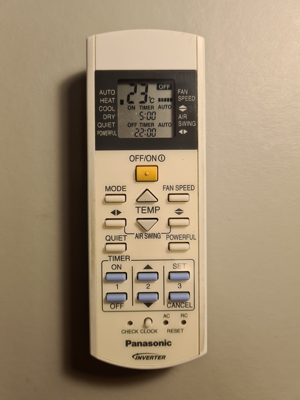
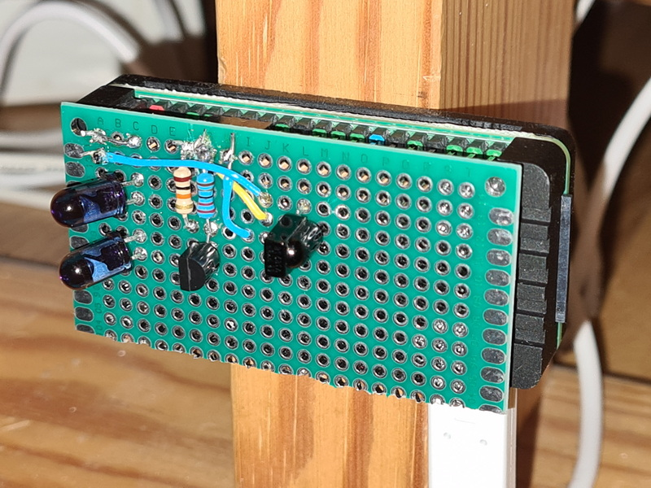

# Raspberry Pi IR Remote Control for the Panasonic Inverter

This Raspberry Pi project is a reverse engineering of the Panasonic Inverter IR Controller A75C3115. The Panasonic inverter can only be controlled with IR signals, there is no WiFi. The only "programming" that can be done is to set a daily on and off timer.

The goal of this Raspberry Pi project is to create an IR remote control connected to the network, allowing the Panasonic inverter to be controlled remotely, and the ability to schedule configuration changes to be applied at given times.

The project builds upon and draws inspiration from multiple Pi projects and work done by others. In the documentation, I have linked to some of the material that I found particularly useful for this project.

The project spans over everything from hardware (Raspberry Pi, microcomponents, soldering), to software (Go application programming, web interface frontend + backend, SQL, low-level bit wrangling), to Linux kernel patching. In this project, I have

* soldered a PCB with IR receiver and sender that fits as a HAT on a the GPIO of a Raspberry Pi Zero 2 W,
* set up a cross-compilation environment running in WSL in Windows, using VS Code and GoLang,
* written software to analyze the IR signals sent by the IR remote control,
* written command-line and web-based utilities to control the Panasonic Inverter, and
* backported patches from Linux 6.8 to 6.6 and installed a custom kernel on the Raspberry Pi to improve the IR transmission precision.

## Features

* Runs on a Raspberry Pi Zero 2 W
* IR receiver and sender
* `decode` command line utility to analyze the configuration messages sent by the remote control
* `paninv_rc` command line utility to send configuration messages to the inverter
* `paninv_controller` service that provides a web interface and schedules automatic jobs

## The controller

`paninv_controller` currently implements:

* a web interface that implements the full behavior of the IR remote control, providing real remote control of the inverter,
* a scheduler that runs jobs on configurable schedules to change the inverter configuration,
* an IR sender that sends configuration messages from either the web interface or the scheduler,
* an IR receiver that intercepts configuration messages sent from the standard IR remote control, so that the controller is aware of any configuration changes done that way.

Data is stored in an SQLite database, which is shared between `paninv_controller` and `paninv_rc`.

There is currently no web interface to manage jobs scheduling. They can be uploaded to the database from a JSON file using the command line.

## Documentation

* [Hardware](docs/Hardware.md)
* [Configuration](docs/Configuration.md)
* [Development environment](docs/Development.md)
* [Analysis of the remote control](docs/Analysis.md)

