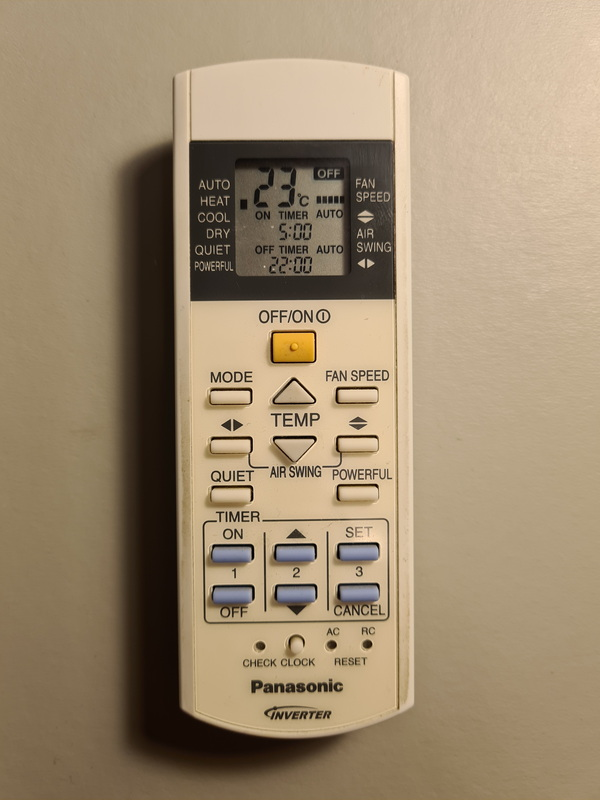

# Analysis of the Panasonic Inverter IR Controller A75C3115

The Panasonic Inverter Remote Controller A75C3115



## <a name="previous_analysis"></a>Examples of reverse engineering of Panasonic Inverter Remote Controllers

<https://www.analysir.com/blog/2014/12/27/reverse-engineering-panasonic-ac-infrared-protocol/>

<https://www.instructables.com/Reverse-engineering-of-an-Air-Conditioning-control/>

## Reference material for kernel LIRC Device Interface

<https://www.kernel.org/doc/html/v6.1/userspace-api/media/rc/lirc-dev.html>

<https://www.mess.org/2020/01/26/Moving-from-lirc-tools-to-rc-core-tooling/>

## Interpreting the raw LIRC data

The raw data provided by the LIRC kernel module consists of unsigned 32-bit integers. All data read from /dev/lirc-rc is LittleEndian, therefore each group of four bytes (32 bits) have the least significant bit to the left and the most significant bit to the right. The conversion to unsigned 32-bit integers must use LittleEndian conversion.

The unsigned integers are in a format known as [LIRC Mode2](https://www.kernel.org/doc/html/v6.1/userspace-api/media/rc/lirc-dev-intro.html#lirc-modes). These represent the pulses and spaces detected by the IR receiver. Each integer is the duration of either a pulse or a space. The duration is never exact, so the data needs to be "cleaned" (rounded to the expected values). The cleaned-up LIRC Mode2 integers can then be interpreted as bits. It's actually the spaces that represent the bits, using two different durations, while pulses are all the same duration.

According to the [previous analysis](#previous_analysis) of the Panasonic Inverter remote control IR protocol, the data sent by the remote control consists of two frames. The first frame is constant, while the second contains the configuration. In these previous analysis, the authors have chosen to view the bits as a series of bytes. This leads to some problems later when interpreting the bits, because 

* fields are not multiples of 8 bits, instead they can be e.g. 5 or 11 bits
* fields are not always aligned to byte boundaries
* bits are sent in LitleEndian (the first received bit is the least significant), which means the bit order would also need to be reversed to get the correct values.

I have chosen to regard the received bits in each frame as a stream of bits. The first received bit is the least significant and the last received bit is the most significant. Each frame is stored in a BigInt. The first received bit is saved at index 0 in the BigInt, the second at index 1 in the BigInt, and so on. This reverses the bit order, so that we end up with bits saved in normal BigEndian representation. To get the value of a field, we can specify the field's first bit (the index of the least significant bit) and the number of bits (to the left of the first bit), and extract those bits with simple bit operations on the BigInt.

### Message structure

A message consists of two frames. The first frame has 64 bits which never change, the second frame has 152 bits and contains the configuration. The IR message format is:

1. Start of message marker (pulse 3500 µs)
1. Start of message marker (space 1750 µs)
1. Frame 1 data (64 bits): alternating pulses and spaces, beginning and ending with a pulse
    * 65 pulses (435 µs)
    * 64 spaces representing bits (0 = 435 µs, 1 = 1300 µs)
1. Frame separator (space 10000 µs)
1. Frame 2 data (152 bits): alternating pulses and spaces, beginning and ending with a pulse
    * 153 pulses (435 µs)
    * 152 spaces representing bits (0 = 435 µs, 1 = 1300 µs)

### Conversion steps

1. Read bytes from the LIRC device. (raw []byte)
1. Convert to unsigned 32-bit integers in LittelEndian mode. (LIRC Mode2 []uint)
1. Clean up the Mode2 data by rounding pulses and spaces to the expected values, using the known Panasonic Inverter remote control IR protocol. (Clean LIRC Mode2 []uint)
1. Parse the clean LIRC Mode2 data to a Panasonic message, consisting of two frames of bits. (Message with two Frames)
1. Verify the checksum.
1. Extract the known fields from the second frame of the message to a configuration struct. (RcConfig)

The code contains code to convert back and forth between these different representations:

* raw bytes
* LIRC Mode2 unsigned integers
* Message with Frames
* Configuration settings

## Analyzing frame 2 (the configuration)

### Decoding frame 2

The first step was to write a utility could receive the IR signals, parse them into message frames, and print them in various representations for debug purposes. The utility, `decode`, can print the frame BigInt in binary, and indicate which bits have changed compared to the previous message it received. This allowed me use the remote control to discover which bits control various settings.

Here is an example where the temperature is changing (16 => 17 => 26 => 27 >= 29 => 30). Bits 41-45:

```
$ decode -log-level=info -msg -diff
Message as bit stream (first and least significant bit to the right)
                 56       48       40       32       24       16        8        0
1:   64/0 [00000110 00000000 00000000 00000000 00000100 11100000 00100000 00000010] true
                144      136      128      120      112      104       96       88       80       72       64       56       48       40       32       24       16        8        0
2:  152/0 [11101000 00000110 00000000 10000000 00000000 00000000 11100000 00001110 00000000 00001101 01110010 10000000 00100000 01001111 00000000 00000100 11100000 00100000 00000010] true
Message as bit stream (first and least significant bit to the right)
                 56       48       40       32       24       16        8        0
1:   64/0 [00000110 00000000 00000000 00000000 00000100 11100000 00100000 00000010] true
                144      136      128      120      112      104       96       88       80       72       64       56       48       40       32       24       16        8        0
2:  152/0 [11101010 00000110 00000000 10000000 00000000 00000000 11100000 00001110 00000000 00001101 01110010 10000000 00100010 01001111 00000000 00000100 11100000 00100000 00000010] true
                 ^                                                                                                           ^
Message as bit stream (first and least significant bit to the right)
                 56       48       40       32       24       16        8        0
1:   64/0 [00000110 00000000 00000000 00000000 00000100 11100000 00100000 00000010] true
                144      136      128      120      112      104       96       88       80       72       64       56       48       40       32       24       16        8        0
2:  152/0 [11111100 00000110 00000000 10000000 00000000 00000000 11100000 00001110 00000000 00001101 01110010 10000000 00110100 01001111 00000000 00000100 11100000 00100000 00000010] true
              ^ ^^                                                                                                        ^ ^^
Message as bit stream (first and least significant bit to the right)
                 56       48       40       32       24       16        8        0
1:   64/0 [00000110 00000000 00000000 00000000 00000100 11100000 00100000 00000010] true
                144      136      128      120      112      104       96       88       80       72       64       56       48       40       32       24       16        8        0
2:  152/0 [11111110 00000110 00000000 10000000 00000000 00000000 11100000 00001110 00000000 00001101 01110010 10000000 00110110 01001111 00000000 00000100 11100000 00100000 00000010] true
                 ^                                                                                                           ^
Message as bit stream (first and least significant bit to the right)
                 56       48       40       32       24       16        8        0
1:   64/0 [00000110 00000000 00000000 00000000 00000100 11100000 00100000 00000010] true
                144      136      128      120      112      104       96       88       80       72       64       56       48       40       32       24       16        8        0
2:  152/0 [00000010 00000110 00000000 10000000 00000000 00000000 11100000 00001110 00000000 00001101 01110010 10000000 00111010 01001111 00000000 00000100 11100000 00100000 00000010] true
                 ^                                                                                                          ^ 
Message as bit stream (first and least significant bit to the right)
                 56       48       40       32       24       16        8        0
1:   64/0 [00000110 00000000 00000000 00000000 00000100 11100000 00100000 00000010] true
                144      136      128      120      112      104       96       88       80       72       64       56       48       40       32       24       16        8        0
2:  152/0 [00000100 00000110 00000000 10000000 00000000 00000000 11100000 00001110 00000000 00001101 01110010 10000000 00111100 01001111 00000000 00000100 11100000 00100000 00000010] true
                ^^                                                                                                          ^^
```

Here is an example where Quiet is turned on, then Powerful is turned on (which turns off Quiet), then Powerful is turned off. At the same time, the fan speed changes to Lowest (3), then Auto (10), then back to the original value Highest (7). Bits 109 (Quiet), 104 (Powerful), and 68-71 (fan):

```
Message as bit stream (first and least significant bit to the right)
                 56       48       40       32       24       16        8        0
1:   64/0 [00000110 00000000 00000000 00000000 00000100 11100000 00100000 00000010] true
                144      136      128      120      112      104       96       88       80       72       64       56       48       40       32       24       16        8        0
2:  152/0 [11100100 00000110 00000000 10000000 00000000 00100000 11100000 00001110 00000000 00001101 00110010 10000000 00111100 01001111 00000000 00000100 11100000 00100000 00000010] true
           ^^^                                            ^                                           ^
Message as bit stream (first and least significant bit to the right)
                 56       48       40       32       24       16        8        0
1:   64/0 [00000110 00000000 00000000 00000000 00000100 11100000 00100000 00000010] true
                144      136      128      120      112      104       96       88       80       72       64       56       48       40       32       24       16        8        0
2:  152/0 [00110101 00000110 00000000 10000000 00000000 00000001 11100000 00001110 00000000 00001101 10100010 10000000 00111100 01001111 00000000 00000100 11100000 00100000 00000010] true
           ^^ ^   ^                                       ^    ^                                     ^  ^
Message as bit stream (first and least significant bit to the right)
                 56       48       40       32       24       16        8        0
1:   64/0 [00000110 00000000 00000000 00000000 00000100 11100000 00100000 00000010] true
                144      136      128      120      112      104       96       88       80       72       64       56       48       40       32       24       16        8        0
2:  152/0 [00000100 00000110 00000000 10000000 00000000 00000000 11100000 00001110 00000000 00001101 01110010 10000000 00111100 01001111 00000000 00000100 11100000 00100000 00000010] true
             ^^   ^                                            ^                                     ^^ ^
```

### Interpretation of frame 2

Bits are counted from right to left in the BigInt. Bit 0 is the least significant bit, and bit 151 is the most significant bit. The number of bits in a field are counted to the left from the start bit.


* Power:
    * 1 bit starting at bit 40
    * 0=off 1=on
* Timer on:
    * 1 bit starting at bit 41
    * 0=off 1=on
* Timer off:
    * 1 bit starting at bit 42
    * 0=off 1=on
* Mode:
    * 4 bits starting at bit 44
    * 0=auto 2=dry 3=cool 4=heat
* Temperature:
    * 5 bits starting at bit 49
    * values from 16-30
* Air vent vertical position:
    * 4 bits starting at bit 64
    * 1=highest 2=high 3=middle 4=low 5=lowest 15=auto
* Fan speed:
    * 4 bits starting at bit 68
    * 3=lowest 4=low 5=middle 6=high 7=highest 10=auto
* Air vent horizontal position:
    * 4 bits starting at bit 72
    * 9=farleft 10=left 6=middle 11=right 12=farright 13=auto
* Timer on time:
    * 11 bits starting at bit 80
    * time of day in minutes
* Timer off time:
    * 11 bits starting at bit 92
    * time of day in minutes
* Powerful:
    * 1 bit starting at bit 104
    * 0=off 1=on
* Quiet:
    * 1 bit starting at bit 109
    * 0=off 1=on
* Clock (current time):
    * 11 bits starting at bit 128
    * time of day in minutes
* Checksum:
    * 8 bits starting at bit 144
    * 8-bit unsigned integer sum of the other 18 bytes

As can be seen, there is apparently no obvious reason for the number of bits or the values used to represent different settings. Mode could have used just 2 bits, and air vents and fan speed could have used just 3 bits. I'm guessing that the same remote control hardware and IR protocol is used for many different products, and that other values could then be used with them.

### Remote control logic

The remote control implements some logic:

* The temperature and fan speed settings are saved for each Mode (auto, heat, cool, dry). When the mode is changed, the saved temperature and fan speed are restored.
* Quiet and Powerful are mutually exclusive. They override the fan speed setting to Lowest and Auto.

#### Times

Timers and the clock time are represented as number of minutes:

* 00:00 = 0
* 23:59 = 1439 = 0x59F

This uses exactly 11 bits: 0x59F = 0b10110011111.

The remote control has a special behavior. The time fields are only set when a timer is being modified (set or cancelled on the remote control). When a timer is not being set, all three time fields are set to the special value 25:36, which happens to be 0x600 = 0b11000000000.

I'm guessing that the designers didn't want to reset the inverter's internal clock and timers unnecessarily every time some other setting was changed.

#### Checksum

The checksum of a frame is easily computed by converting the BigInt to bytes, then computing an unsigned 8-bit integer sum of all bytes except the last (leftmost) one. Overflowing bits will be discarded. The result should be equal to the last (leftmost) byte. This is used to verify a received message, and to set the checksum before sending a message.


### Message template

Just like the bits in frame 1 never change, frame 2 also contains bits that never change. Presumably these are for other types of configuration, or have some kind of internal purpose for development and debugging. There are also a few special buttons on the remote control (Check, Reset AC, Reset RC), which I haven't investigated.

When sending a message, we can start from a message "template" containing all the bits that never change, and simply merge in the configuration bits before sending the message. Here is the byte representation of the frame templates:

```go
// The constant first frame (64 bits) used by the Panasonic IR Controller A75C3115
func P_PANASONIC_FRAME1() []byte {
	// this is the big.Int value as bytes, which can be used to initialize a message when sending
	return []byte{
		0b00000110,
		0b00000000,
		0b00000000,
		0b00000000,
		0b00000100,
		0b11100000,
		0b00100000,
		0b00000010,
	}
}

// A template for the second frame (152 bits) used by the Panasonic IR Controller A75C3115
func P_PANASONIC_FRAME2() []byte {
	// this is the big.Int value as bytes, which can be used to initialize a message when sending
	return []byte{
		0b00000000, // checksum (8 bits)
		0b00000000, // unused (5 bits), clock time (3 bits)
		0b00000000, // clock time (8 bits)
		0b10000000, // unused?
		0b00000000, // unused?
		0b00000000, // powerful, quiet (6 unused bits?)
		0b10000000, // unused (1 bit), timer off (7 bits)
		0b00001000, // timer off (4 bits), unused (1 bit), timer on (3 bits)
		0b00000000, // timer on (8 bits)
		0b00000000, // unused (4 bits), vent hpos (4 bits)
		0b00000000, // fan speed (4 bits), vent vpos (4 bits)
		0b10000000, // unused?
		0b00000000, // unused (2 bits), temperature (5 bits), unused (1 bit)
		0b01001000, // power, timer on, timer off (5 unused bits?)
		0b00000000, // unused?
		0b00000100, // unused?
		0b11100000, // unused?
		0b00100000, // unused?
		0b00000010, // unused?
	}
}
```