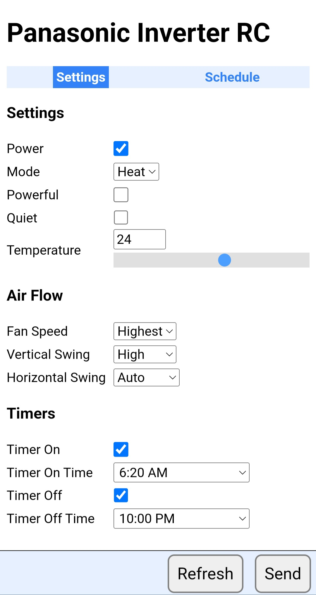

# Applications and Utilities

## decode

```
$ decode -help
Usage of decode:
  -bytes
        print message as bytes
  -config
        print decoded configuration
  -diff
        print difference from previous
  -help
        print usage
  -irin string
        LIRC source (file or device) (default "/dev/lirc-rx")
  -log-level string
        log level [debug|info|warn|error] (default "debug")
  -msg
        print message
  -rec-clean
        receive option: print cleaned up pulse data
  -rec-dev
        receive option: reading from LIRC device (default true)
  -rec-raw
        receive option: print raw pulse data
```

# paninv_rc

```
$ paninv_rc -help
Usage of paninv_rc:
  -db string
        SQLite database (default "/home/mhy/paninv/paninv.db")
  -fan string
        fan speed (set per mode, overridden if powerful or quiet is enabled) [auto|lowest|low|middle|high|highest]
  -help
        print usage
  -horiz string
        vent horizontal position [auto|farleft|left|middle|right|farright]
  -irout string
        LIRC output device or file (default "/dev/lirc-tx")
  -log-level string
        log level [debug|info|warn|error] (default "warn")
  -mode string
        mode [auto|heat|cool|dry]
  -power string
        power [on|off]
  -powerful string
        powerful [on|off]
  -prio int
        The priority, or niceness, of the process (-20..19) (default -10)
  -quiet string
        quiet [on|off]
  -send-dev
        send option: writing to a LIRC device (default true)
  -send-int int
        send option: number of milliseconds between transmissions (default 20)
  -send-mode2
        send option: output in mode2 format (when writing to file for sending with ir-ctl)
  -send-tx int
        send option: number of times to send the message (default 1)
  -show
        show the current configuration
  -temp string
        temperature (set per mode)
  -toff string
        timer_off [on|off]
  -tofft string
        timer_off time, e.g. 21:00
  -ton string
        timer_on [on|off]
  -tont string
        timer_on time, e.g. 09:00
  -verbose
        print verbose output
  -vert string
        vent vertical position [auto|lowest|low|middle|high|highest]
```

# paninv_controller

```
$ paninv_controller -help
  -bytes
        print message as bytes
  -config
        print decoded configuration
  -db string
        SQLite database (default "/home/mhy/paninv/paninv.db")
  -help
        print usage
  -irin string
        LIRC receive device (default "/dev/lirc-rx")
  -irout string
        LIRC transmit device (default "/dev/lirc-tx")
  -load-jobs string
        load cronjobs from file
  -log-level string
        log level [debug|info|warn|error] (default "info")
  -msg
        print message
  -rec-clean
        receive option: print cleaned up pulse data
  -rec-raw
        receive option: print raw pulse data
  -send-dev
        send option: writing to a LIRC device (default true)
  -send-int int
        send option: number of milliseconds between transmissions (default 20)
  -send-mode2
        send option: output in mode2 format (when writing to file for sending with ir-ctl)
  -send-tx int
        send option: number of times to send the message (default 1)
```



Using icons from [Icons8](https://icons8.com).