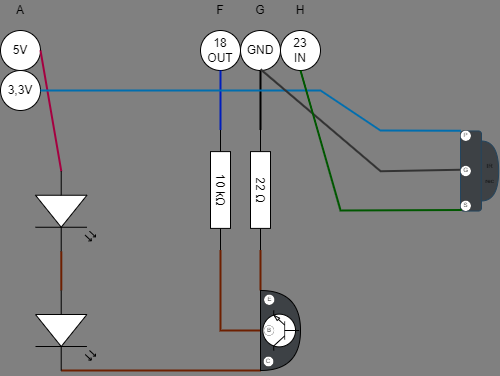
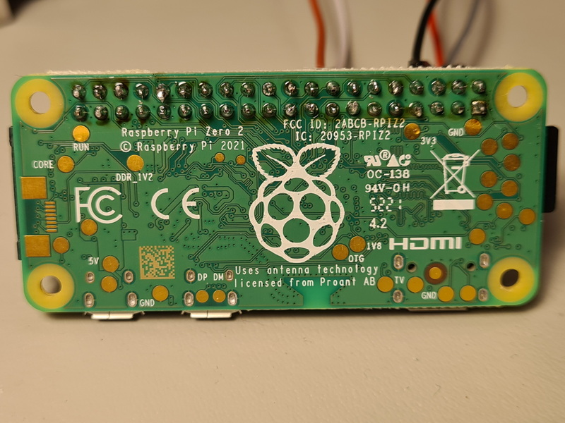
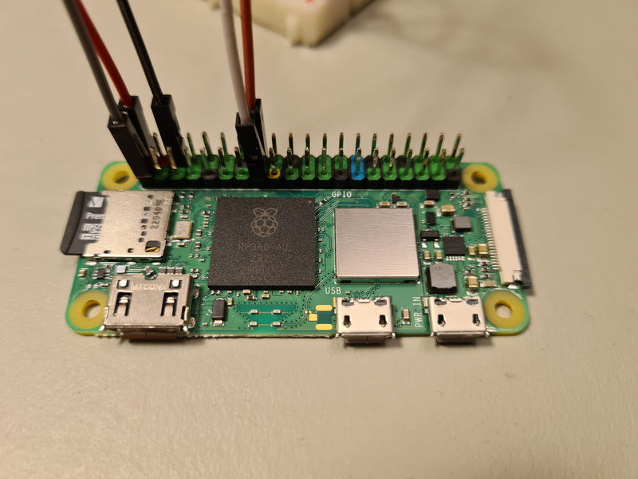
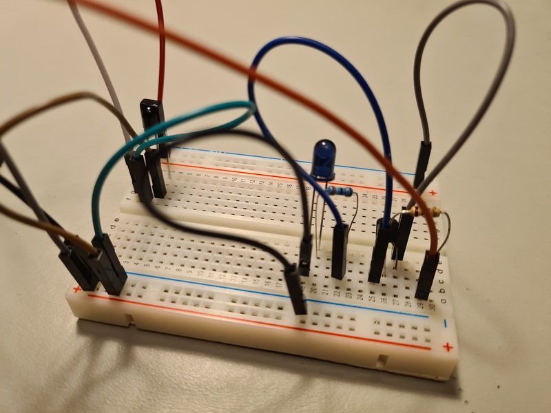
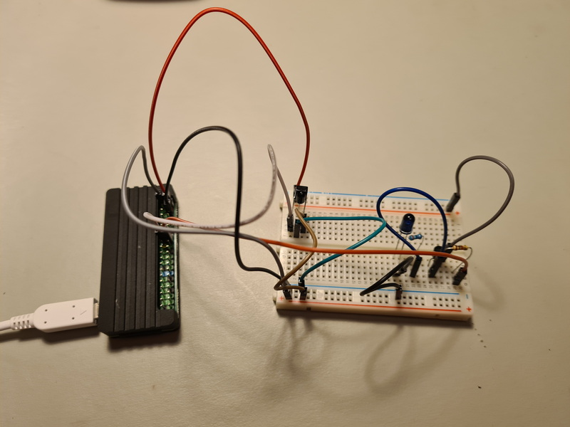
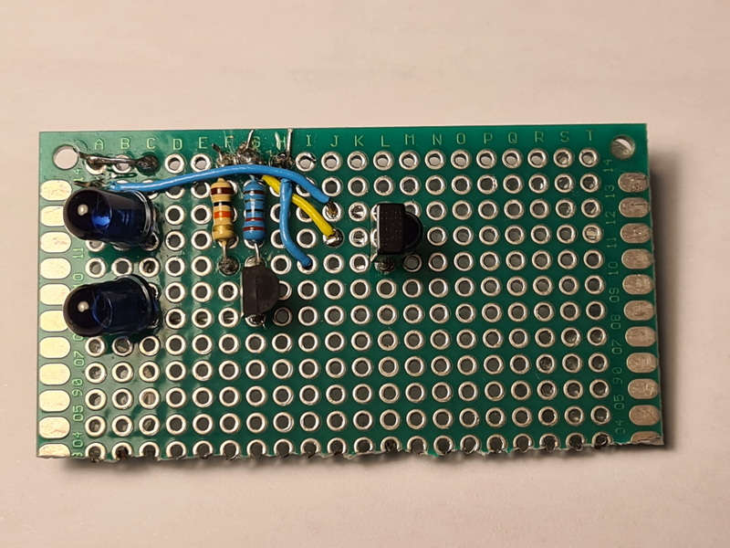
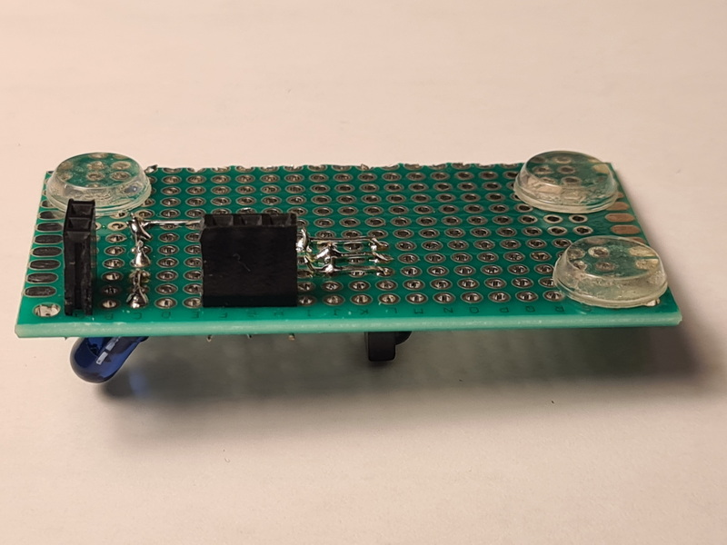

# Hardware and Circuits

## Various tutorials

1. https://www.digikey.se/en/maker/tutorials/2021/how-to-send-and-receive-ir-signals-with-a-raspberry-pi
2. https://devkimchi.com/2020/08/12/turning-raspberry-pi-into-remote-controller/
3. https://blog.gordonturner.com/2020/05/31/raspberry-pi-ir-receiver/
4. https://blog.gordonturner.com/2020/06/10/raspberry-pi-ir-transmitter/
5. https://github.com/gordonturner/ControlKit/blob/master/Raspbian%20Setup%20and%20Configure%20IR.md

## List of components

TSOP38238 IR receiver, 38 kHz, 940 nm 
(Supply voltage: 2.5 V to 5.5 V) 
Datasheet https://www.vishay.com/docs/82491/tsop382.pdf

TSAL6200 IR LED, 940 nm 
Datasheet https://www.vishay.com/docs/81010/tsal6200.pdf 
(I used two of these, which is probably not necessary.)

NPN transistor 2N2222A 
Datasheet  https://components101.com/transistors/2n2222a-pinout-equivalent-datasheet

Resistors: 10 kΩ, 22 Ω

Resistors code calculator: https://resistorcolorcodecalc.com

## Connecting the Raspberry Pi Zero 2 W

https://www.raspberrypi.com/documentation/computers/raspberry-pi.html#gpio-and-the-40-pin-header

https://pinout.xyz

[pcb_circuit.drawio](./pcb_circuit.drawio)

The 22 Ω resistor was calculated as follows, with two LEDs in series:

* IR LED TSAL6200
  * Vforward = 1,35 V
  * Imax = 100 mA
* NPN 2N2222
  * Vce,sat = 0,3 V
  * Ice,max = 800 mA

Imax for the LEDs is the limiting current. Voltage falls over each of the three components:

VR = 5,0 V - 2\*Vforward - Vce,sat = 5,0 - 2\*1,35 - 0,3 V = 2,0 V

R = VR / Imax = 2,0 V / 0,1 A = 20,0 Ω

The next biggest resistor was 22 Ω.

## Pictures

